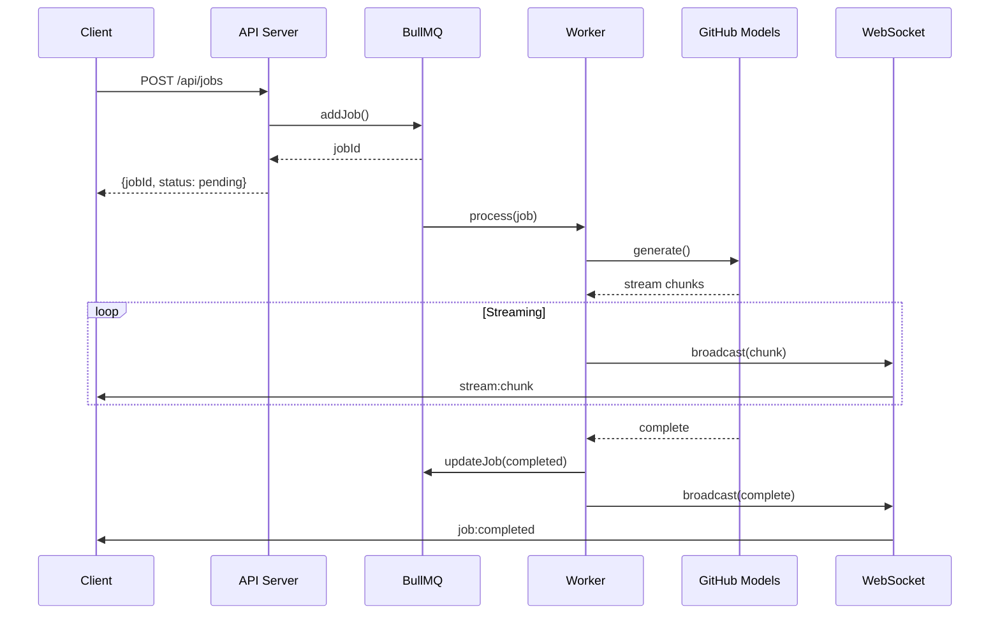

# 🏗️ MediSync Architektur-Dokumentation

> Detaillierte Beschreibung der Systemarchitektur, Komponenten und Datenflüsse.

---

## 📋 Inhaltsverzeichnis

- [Übersicht](#-übersicht)
- [Systemarchitektur](#-systemarchitektur)
- [Komponenten](#-komponenten)
- [Datenfluss](#-datenfluss)
- [Technologie-Stack](#-technologie-stack)
- [Datenmodelle](#-datenmodelle)
- [Sicherheit](#-sicherheit)
- [Skalierung](#-skalierung)

---

## 🎯 Übersicht

Die MediSync Agenten-Plattform ist eine modulare, ereignisgesteuerte Architektur, die es ermöglicht, KI-gestützte Agenten über verschiedene Kanäle (Discord, Web, API) anzusprechen und zu verwalten.

### Design-Prinzipien

| Prinzip | Beschreibung |
|---------|-------------|
| **Separation of Concerns** | Klare Trennung zwischen API, Services und Clients |
| **Asynchronous Processing** | Alle AI-Requests werden asynchron über Queue verarbeitet |
| **Event-Driven** | WebSocket-basierte Echtzeit-Updates |
| **Horizontal Scalable** | Stateless Services, skalierbar via Docker/Kubernetes |
| **Multi-Tenant Ready** | User/Session-basierte Isolation |

---

## 🏛️ Systemarchitektur

### High-Level Architecture

```
┌─────────────────────────────────────────────────────────────────────────────────┐
│                              🌍 Externe Services                                 │
├──────────────────────────────┬──────────────────────────────────────────────────┤
│     GitHub Models API        │         Cloudflare Tunnel                       │
│  ┌────────────────────────┐  │  ┌─────────────────────────────────────────┐    │
│  │ • GPT-4o               │  │  │ • API: api.ihrefirma.de               │    │
│  │ • Claude 3.5           │  │  │ • WebSocket: ws.ihrefirma.de          │    │
│  │ • Llama 3.x            │  │  │ • Dashboard: dashboard.ihrefirma.de   │    │
│  │ • Embeddings           │  │  │ • code-server: code.ihrefirma.de      │    │
│  └────────────────────────┘  │  └─────────────────────────────────────────┘    │
└──────────────────────────────┴──────────────────────────────────────────────────┘
                                         ▲
                                         │
┌─────────────────────────────────────────────────────────────────────────────────┐
│                           🚀 MediSync Plattform                                  │
├─────────────────────────────────────────────────────────────────────────────────┤
│                                                                                 │
│  ┌─────────────────────────────────────────────────────────────────────────┐   │
│  │                        🌐 Client Layer                                   │   │
│  ├───────────────┬───────────────┬─────────────────┬───────────────────────┤   │
│  │  Discord Bot  │  Dashboard    │  VS Code Ext    │  External API Clients │   │
│  │  (Node.js)    │  (React/Vite) │  (TypeScript)   │  (REST/WebSocket)     │   │
│  └───────┬───────┴───────┬───────┴────────┬────────┴───────────┬───────────┘   │
│          │               │                │                    │               │
│          └───────────────┴────────────────┴────────────────────┘               │
│                                   │                                             │
│                                   ▼                                             │
│  ┌─────────────────────────────────────────────────────────────────────────┐   │
│  │                      📡 API Gateway Layer                                │   │
│  │  ┌─────────────────────────────────────────────────────────────────┐   │   │
│  │  │  Express.js Server (Port 3000)                                   │   │   │
│  │  │  ├── CORS Configuration                                          │   │   │
│  │  │  ├── Security Headers (Helmet)                                   │   │   │
│  │  │  ├── Rate Limiting (60/min, 1000/hr, 10000/day)                  │   │   │
│  │  │  ├── Usage Tracking Middleware                                   │   │   │
│  │  │  ├── Request Validation (express-validator)                      │   │   │
│  │  │  └── Request Logging                                             │   │   │
│  │  └─────────────────────────────────────────────────────────────────┘   │   │
│  └─────────────────────────────────────────────────────────────────────────┘   │
│                                   │                                             │
│                                   ▼                                             │
│  ┌─────────────────────────────────────────────────────────────────────────┐   │
│  │                      ⚙️ Service Layer                                    │   │
│  │  ┌─────────────┐ ┌─────────────┐ ┌─────────────┐ ┌───────────────────┐  │   │
│  │  │ Job Service │ │ AI Service  │ │  Billing    │ │     Metrics       │  │   │
│  │  │ ├─ Queue    │ │ ├─ Router   │ │ ├─ Budget   │ │ ├─ Prometheus     │  │   │
│  │  │ ├─ Worker   │ │ ├─ Client   │ │ ├─ Invoice  │ │ ├─ Health Checks  │  │   │
│  │  │ └─ WebSocket│ │ └─ Stream   │ │ └─ Alerts   │ │ └─ Analytics      │  │   │
│  │  └─────────────┘ └─────────────┘ └─────────────┘ └───────────────────┘  │   │
│  └─────────────────────────────────────────────────────────────────────────┘   │
│                                   │                                             │
│                                   ▼                                             │
│  ┌─────────────────────────────────────────────────────────────────────────┐   │
│  │                      🗄️ Data Layer                                       │   │
│  │  ┌──────────────────────────┐  ┌─────────────────────────────────────┐  │   │
│  │  │     Redis (BullMQ)       │  │         Local State                 │  │   │
│  │  │  ┌────────────────────┐  │  │  ┌─────────────────────────────┐    │  │   │
│  │  │  │ • Job Queue        │  │  │  │ • Session Memory (Discord)  │    │  │   │
│  │  │  │ • Job State        │  │  │  │ • Rate Limit Cache          │    │  │   │
│  │  │  │ • Rate Counters    │  │  │  │ • Connection Pool           │    │  │   │
│  │  │  │ • Usage Analytics  │  │  │  └─────────────────────────────┘    │  │   │
│  │  │  │ • Token Tracker    │  │  └─────────────────────────────────────┘  │   │
│  │  │  └────────────────────┘  │                                           │   │
│  │  └──────────────────────────┘                                           │   │
│  └─────────────────────────────────────────────────────────────────────────┘   │
│                                                                                 │
└─────────────────────────────────────────────────────────────────────────────────┘
```

---

## 🧩 Komponenten

### 1. Backend (`/backend`)

#### 1.1 API Server (`src/server.ts`)

| Aspekt | Beschreibung |
|--------|-------------|
| **Framework** | Express.js 4.x |
| **Port** | 3000 (konfigurierbar) |
| **CORS** | Dynamische Origin-Prüfung, Credentials erlaubt |
| **Rate Limiting** | 60/min, 1000/hr, 10000/day pro User |
| **Body Parsing** | 10MB Limit für JSON/URL-encoded |

```typescript
// Haupt-Initialisierung
const app = express();
app.use(cors(corsOptions));
app.use(express.json({ limit: '10mb' }));
app.use(usageMiddleware.middleware());
```

#### 1.2 Routes

| Route | Pfad | Beschreibung |
|-------|------|-------------|
| **Jobs** | `/api/jobs` | CRUD für Agent-Jobs |
| **Health** | `/health` | Health Checks und Status |
| **Stats** | `/api/stats` | Nutzungsstatistiken |
| **Budget** | `/api/budget/:userId` | Budget-Verwaltung |
| **Metrics** | `/api/metrics` | Prometheus-Metriken |

#### 1.3 Job Queue (`src/queue/agentQueue.ts`)

```
┌─────────────────────────────────────────────────────────────┐
│                     BullMQ Queue                            │
├─────────────────────────────────────────────────────────────┤
│                                                             │
│  ┌──────────────┐    ┌──────────────┐    ┌──────────────┐  │
│  │   Producer   │───▶│    Queue     │───▶│    Worker    │  │
│  │  (API Server)│    │  (Redis)     │    │  (AI Client) │  │
│  └──────────────┘    └──────────────┘    └──────────────┘  │
│                              │                              │
│                              ▼                              │
│                       ┌──────────────┐                     │
│                       │  Scheduler   │                     │
│                       │  (Delayed)   │                     │
│                       └──────────────┘                     │
│                                                             │
│  Job Lifecycle:                                             │
│  pending → active → completed|failed|cancelled              │
│                                                             │
└─────────────────────────────────────────────────────────────┘
```

**Job-Status:**
- `pending` - Wartet auf Verarbeitung
- `active` - Wird aktuell bearbeitet
- `completed` - Erfolgreich abgeschlossen
- `failed` - Fehler aufgetreten (retry möglich)
- `cancelled` - Manuell abgebrochen

#### 1.4 AI Service (`src/ai/`)

| Komponente | Datei | Beschreibung |
|------------|-------|-------------|
| **Client** | `githubModelsClient.ts` | GitHub Models API Integration |
| **Router** | `modelRouter.ts` | Modell-Auswahl basierend auf Task |
| **Streaming** | `streamingHandler.ts` | SSE/WebSocket Streaming |
| **Token Tracker** | `tokenTracker.ts` | Usage Tracking in Redis |

**Unterstützte Modelle:**

| Modell | Provider | Use Case |
|--------|----------|----------|
| `gpt-4o` | OpenAI | Komplexe Analysen, Reasoning |
| `claude-3-5-sonnet` | Anthropic | Lange Kontexte, präzise Antworten |
| `o1-mini` | OpenAI | Schnelle Reasoning-Tasks |
| `llama-3.3-70b` | Meta | Kosten-effizient, lokal-freundlich |

#### 1.5 WebSocket Server (`src/websocket/streaming.ts`)

```
┌─────────────────────────────────────────────────────────────┐
│                 WebSocket Architektur                       │
├─────────────────────────────────────────────────────────────┤
│                                                             │
│  Client ──▶ WS Server ──▶ Broadcast ──▶ Alle Subscribers   │
│                                                             │
│  Events:                                                    │
│  ├── job:created   - Neuer Job erstellt                     │
│  ├── job:updated   - Status-Update                          │
│  ├── job:completed - Job fertig mit Ergebnis                │
│  ├── stream:start  - Streaming beginnt                      │
│  ├── stream:chunk  - Chunk empfangen                        │
│  └── stream:end    - Streaming beendet                      │
│                                                             │
│  Port: 8080 (konfigurierbar)                                │
│                                                             │
└─────────────────────────────────────────────────────────────┘
```

### 2. Discord Bot (`/bot/discord`)

#### 2.1 Architektur

```
┌─────────────────────────────────────────────────────────────┐
│                  Discord Bot Architektur                    │
├─────────────────────────────────────────────────────────────┤
│                                                             │
│  Discord Gateway ◀──▶ Bot Client ◀──▶ Command Handler      │
│                                      │                      │
│                                      ▼                      │
│                           ┌──────────────────┐             │
│                           │  Session Manager │             │
│                           │  - User Sessions │             │
│                           │  - Rate Limiting │             │
│                           └────────┬─────────┘             │
│                                    │                        │
│                                    ▼                        │
│                           ┌──────────────────┐             │
│                           │   API Client     │             │
│                           │  - REST API      │             │
│                           │  - WebSocket     │             │
│                           └────────┬─────────┘             │
│                                    │                        │
│                                    ▼                        │
│                           ┌──────────────────┐             │
│                           │  MediSync API    │             │
│                           └──────────────────┘             │
│                                                             │
└─────────────────────────────────────────────────────────────┘
```

#### 2.2 Commands

| Command | Beschreibung | Parameter |
|---------|-------------|-----------|
| `/agent` | Hauptbefehl für AI-Interaktion | `prompt` (required), `model` (optional) |

**Beispiel-Interaktion:**
```
User: /agent prompt:Analysiere: Patient 45J, Fieber 39°, Husten

Bot: 🏥 **MediSync Agent**
━━━━━━━━━━━━━━━━━━━━━━
📋 **Anforderung wird verarbeitet...**
🆔 Job-ID: `550e8400-e29b-41d4-a716-446655440000`
⏱️ Geschätzte Zeit: ~5s

[2 Sekunden später]

✅ **Analyse abgeschlossen**

🏥 **Mögliche Diagnosen:**
• Virale Infektion (wahrscheinlich)
• Bakterielle Pneumonie (ausschließen)

📊 **Empfohlene Maßnahmen:**
• Labordiagnostik (CRP, BB, Lymphozyten)
• Röntgen Thorax falls persistierend

💰 **Kosten:** $0.0012 (GPT-4o)
```

### 3. Dashboard (`/dashboard`)

#### 3.1 Tech Stack

| Komponente | Technologie |
|------------|-------------|
| **Framework** | React 18 |
| **Build Tool** | Vite 5 |
| **Styling** | CSS Variables + Tailwind |
| **State Management** | React Query |
| **HTTP Client** | Axios |
| **WebSocket** | Native WebSocket API |

#### 3.2 Komponenten-Struktur

```
src/
├── App.tsx                    # Hauptkomponente
├── main.tsx                   # Entry Point
├── api/
│   └── jobs.ts               # API Client
├── components/
│   ├── CreateJobModal.tsx    # Job-Erstellung
│   ├── JobDetail.tsx         # Job-Details
│   ├── JobList.tsx           # Job-Liste
│   ├── StatsPanel.tsx        # Statistiken
│   ├── StatusBadge.tsx       # Status-Anzeige
│   └── StreamingView.tsx     # Streaming-Output
├── hooks/
│   ├── useJobs.ts            # Jobs Hook
│   └── useWebSocket.ts       # WebSocket Hook
└── types/
    └── index.ts              # TypeScript Types
```

### 4. VS Code Extension (`/code-server/extensions`)

Integration mit code-server für Cloud-basierte Entwicklung mit Medical AI Features.

---

## 🌊 Datenfluss

### 4.1 Job Creation Flow

```
┌─────────┐     ┌──────────────┐     ┌──────────────┐     ┌──────────────┐
│  Client │────▶│  API Server  │────▶│  BullMQ      │────▶│   Worker     │
│         │     │              │     │  (Redis)     │     │              │
└─────────┘     └──────────────┘     └──────────────┘     └──────┬───────┘
     │                                                           │
     │                                                           ▼
     │                                                    ┌──────────────┐
     │                                                    │  AI Service  │
     │                                                    │  (GitHub     │
     │                                                    │   Models)    │
     │                                                    └──────┬───────┘
     │                                                           │
     │                                                           ▼
     │                                                    ┌──────────────┐
     │                                                    │  Streaming   │
     │                                                    │  Handler     │
     │                                                    └──────┬───────┘
     │                                                           │
     │◀──────────────────────────────────────────────────────────┤
     │                    WebSocket Broadcast                    │
     │                                                           │
     ▼                                                           ▼
┌─────────────────────────────────────────────────────────────────────────┐
│                        Dashboard / Discord / API                        │
└─────────────────────────────────────────────────────────────────────────┘
```

### 4.2 Sequenzdiagramm: Job-Verarbeitung



---

## 🛠️ Technologie-Stack

### Backend

| Komponente | Version | Zweck |
|------------|---------|-------|
| Node.js | 20.x | Runtime |
| TypeScript | 5.3.x | Sprache |
| Express | 4.18.x | Web Framework |
| BullMQ | 5.x | Job Queue |
| Redis | 7.x | Queue Storage & Cache |
| WS | 8.x | WebSocket Server |
| ioredis | 5.x | Redis Client |

### Discord Bot

| Komponente | Version | Zweck |
|------------|---------|-------|
| discord.js | 14.x | Discord API |
| TypeScript | 5.3.x | Sprache |
| WS | 8.x | WebSocket Client |

### Dashboard

| Komponente | Version | Zweck |
|------------|---------|-------|
| React | 18.x | UI Framework |
| Vite | 5.x | Build Tool |
| TypeScript | 5.x | Sprache |
| Axios | 1.6.x | HTTP Client |
| React Query | 3.x | State Management |

### DevOps

| Komponente | Zweck |
|------------|-------|
| Docker | Containerisierung |
| Docker Compose | Multi-Service Orchestration |
| GitHub Codespaces | Cloud Development |
| Cloudflare Tunnel | Public URLs |
| Prometheus | Monitoring |

---

## 📊 Datenmodelle

### Job

```typescript
interface Job {
  id: string;                    // UUID
  userId: string;                // Discord ID oder User ID
  sessionId: string;             // Session Identifier
  prompt: string;                // Eingabe-Prompt
  status: JobStatus;             // pending | active | completed | failed | cancelled
  result?: string;               // AI-Antwort (bei completed)
  error?: string;                // Fehlermeldung (bei failed)
  model: string;                 // Verwendetes Modell
  tokensUsed?: number;           // Verbrauchte Tokens
  cost?: number;                 // Geschätzte Kosten
  createdAt: Date;               // Erstellungszeit
  updatedAt: Date;               // Letztes Update
  completedAt?: Date;            // Abschlusszeit
  retryCount: number;            // Anzahl Retries
}
```

### Usage Record

```typescript
interface UsageRecord {
  userId: string;
  sessionId: string;
  model: string;
  tokensInput: number;
  tokensOutput: number;
  cost: number;
  timestamp: Date;
  endpoint: string;
}
```

### Budget Configuration

```typescript
interface BudgetConfig {
  userId: string;
  dailyLimit: number;            // Default: $5.00
  weeklyLimit: number;           // Default: $25.00
  monthlyLimit: number;          // Default: $100.00
  currency: string;              // Default: USD
  alertsEnabled: boolean;        // Default: true
}
```

---

## 🔒 Sicherheit

### Authentifizierung

| Ebene | Mechanismus |
|-------|-------------|
| API | Header-basiert (X-User-Id, X-Session-Id) |
| Discord | OAuth2 über Discord.js |
| WebSocket | Origin-Prüfung |

### Rate Limiting

```typescript
// Default Limits
const RATE_LIMITS = {
  perMinute: 60,
  perHour: 1000,
  perDay: 10000
};
```

### Budget Protection

```
┌─────────────────────────────────────────────────────────────┐
│                    Budget Check Flow                        │
├─────────────────────────────────────────────────────────────┤
│                                                             │
│  Request ──▶ Check Budget ──▶ Allow/Deny                   │
│                  │                                          │
│                  ▼                                          │
│         ┌─────────────┐                                     │
│         │ daily > 80% │──▶ Warning Alert                   │
│         └─────────────┘                                     │
│                  │                                          │
│                  ▼                                          │
│         ┌─────────────┐                                     │
│         │ daily > 100%│──▶ Block + Alert                   │
│         └─────────────┘                                     │
│                                                             │
└─────────────────────────────────────────────────────────────┘
```

---

## 📈 Skalierung

### Horizontale Skalierung

```
                    ┌──────────────┐
                    │   Load       │
                    │   Balancer   │
                    └──────┬───────┘
                           │
           ┌───────────────┼───────────────┐
           ▼               ▼               ▼
    ┌────────────┐  ┌────────────┐  ┌────────────┐
    │  API       │  │  API       │  │  API       │
    │  Server 1  │  │  Server 2  │  │  Server N  │
    └─────┬──────┘  └─────┬──────┘  └─────┬──────┘
          │               │               │
          └───────────────┼───────────────┘
                          │
                    ┌─────┴─────┐
                    │   Redis   │
                    │  Cluster  │
                    └───────────┘
```

### Worker Skalierung

```yaml
# docker-compose.worker.yml
version: '3.8'
services:
  worker-1:
    build: ./backend
    command: npm run worker
    environment:
      - WORKER_CONCURRENCY=5
    
  worker-2:
    build: ./backend
    command: npm run worker
    environment:
      - WORKER_CONCURRENCY=5
  
  worker-n:
    build: ./backend
    command: npm run worker
    environment:
      - WORKER_CONCURRENCY=5
```

---

## 📚 Weitere Dokumentation

- [Setup Guide](./SETUP.md) - Detaillierte Installationsanleitung
- [API Dokumentation](./API.md) - API-Endpunkte und WebSocket Events
- [Deployment Guide](./DEPLOYMENT.md) - Deployment-Optionen
- [Troubleshooting](./TROUBLESHOOTING.md) - Fehlerbehebung

---

<div align="center">

**[⬆️ Nach oben](#-medisync-architektur-dokumentation)**

</div>
